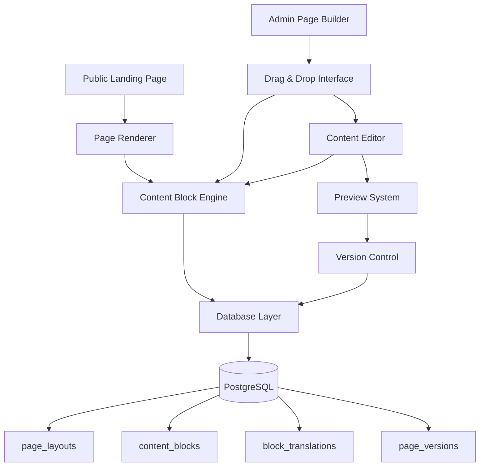

# Design Document: Dynamic Page Builder

## Overview

The Dynamic Page Builder is a comprehensive content management system that enables administrators to customize any public page (landing, about, terms, privacy, contact, etc.) through an intuitive drag-and-drop interface. The system transforms currently static pages into dynamic, customizable experiences while maintaining the existing design aesthetic and functionality.

The solution leverages the existing `appSettings` table for configuration storage and introduces new database tables for content blocks and page layouts. The architecture follows a component-based approach where any public page can be composed of reusable, editable content blocks that can be rearranged, customized, and localized across multiple page types.

## Architecture

### High-Level Architecture



### Component Architecture

The system is built around three main architectural layers:

1. **Presentation Layer**: React components for both public rendering and admin editing
2. **Business Logic Layer**: Server actions for content management and page rendering
3. **Data Layer**: PostgreSQL tables with Drizzle ORM for type-safe database operations

### Technology Stack

- **Frontend**: Next.js 14 with App Router, React 18, TypeScript
- **Styling**: Tailwind CSS with existing design system
- **Drag & Drop**: @dnd-kit/core for accessible drag-and-drop functionality
- **Rich Text Editing**: Tiptap editor for content editing
- **Database**: PostgreSQL with Drizzle ORM
- **Internationalization**: next-intl for multi-language support
- **State Management**: React Context for editor state

## Components and Interfaces

### Database Schema

```typescript
// Page layouts table - stores different page types and their configurations
export const pageLayouts = pgTable("page_layouts", {
  id: serial("id").primaryKey(),
  name: varchar("name", { length: 100 }).notNull(), // e.g., "landing_page", "about_us", "privacy_policy"
  pageType: varchar("page_type", { length: 50 }).notNull(), // "landing", "about", "terms", "privacy", "contact", "custom"
  route: varchar("route", { length: 200 }).notNull(), // "/", "/about", "/privacy-policy", etc.
  title: varchar("title", { length: 200 }), // Page title for SEO
  description: text("description"), // Meta description for SEO
  isActive: boolean("is_active").default(true).notNull(),
  isPublished: boolean("is_published").default(false).notNull(),
  createdBy: integer("created_by").references(() => staff.id),
  createdAt: timestamp("created_at").defaultNow().notNull(),
  updatedAt: timestamp("updated_at").defaultNow().notNull(),
}, (table) => [
  unique("unique_page_route").on(table.route),
  index("page_layouts_page_type_idx").on(table.pageType),
  index("page_layouts_route_idx").on(table.route),
]);

// Content blocks table - stores individual content components
export const contentBlocks = pgTable("content_blocks", {
  id: serial("id").primaryKey(),
  layoutId: integer("layout_id").references(() => pageLayouts.id, { onDelete: "cascade" }).notNull(),
  blockType: varchar("block_type", { length: 50 }).notNull(), // hero, text, image, announcements, etc.
  blockKey: varchar("block_key", { length: 100 }).notNull(), // unique identifier within layout
  displayOrder: integer("display_order").notNull(),
  isVisible: boolean("is_visible").default(true).notNull(),
  configuration: text("configuration"), // JSON configuration for the block
  createdAt: timestamp("created_at").defaultNow().notNull(),
  updatedAt: timestamp("updated_at").defaultNow().notNull(),
});

// Block translations table - stores localized content
export const blockTranslations = pgTable("block_translations", {
  id: serial("id").primaryKey(),
  blockId: integer("block_id").references(() => contentBlocks.id, { onDelete: "cascade" }).notNull(),
  locale: varchar("locale", { length: 10 }).notNull(), // en, ms
  content: text("content"), // JSON content for the specific locale
  createdAt: timestamp("created_at").defaultNow().notNull(),
  updatedAt: timestamp("updated_at").defaultNow().notNull(),
});

// Page versions table - stores version history
export const pageVersions = pgTable("page_versions", {
  id: serial("id").primaryKey(),
  layoutId: integer("layout_id").references(() => pageLayouts.id, { onDelete: "cascade" }).notNull(),
  versionNumber: integer("version_number").notNull(),
  snapshot: text("snapshot").notNull(), // JSON snapshot of the entire page
  createdBy: integer("created_by").references(() => staff.id),
  createdAt: timestamp("created_at").defaultNow().notNull(),
  isPublished: boolean("is_published").default(false).notNull(),
});
```

### Page Type System

```typescript
interface PageType {
  id: string;
  name: string;
  route: string;
  allowedBlocks: string[]; // Which block types are allowed on this page type
  defaultBlocks: ContentBlockTemplate[]; // Default blocks when creating new page
  seoRequired: boolean; // Whether SEO fields are required
}

const PAGE_TYPES: PageType[] = [
  {
    id: 'landing',
    name: 'Landing Page',
    route: '/',
    allowedBlocks: ['hero', 'text', 'announcements', 'statistics', 'features', 'cta'],
    defaultBlocks: [
      { type: 'hero', order: 1 },
      { type: 'announcements', order: 2 },
      { type: 'features', order: 3 },
      { type: 'cta', order: 4 }
    ],
    seoRequired: true
  },
  {
    id: 'about',
    name: 'About Us',
    route: '/about',
    allowedBlocks: ['hero', 'text', 'image', 'team', 'timeline'],
    defaultBlocks: [
      { type: 'hero', order: 1 },
      { type: 'text', order: 2 }
    ],
    seoRequired: true
  },
  {
    id: 'privacy',
    name: 'Privacy Policy',
    route: '/privacy-policy',
    allowedBlocks: ['text', 'accordion', 'table'],
    defaultBlocks: [
      { type: 'text', order: 1 }
    ],
    seoRequired: false
  },
  {
    id: 'terms',
    name: 'Terms of Service',
    route: '/terms-of-service',
    allowedBlocks: ['text', 'accordion', 'table'],
    defaultBlocks: [
      { type: 'text', order: 1 }
    ],
    seoRequired: false
  },
  {
    id: 'contact',
    name: 'Contact Us',
    route: '/contact',
    allowedBlocks: ['hero', 'text', 'contact-form', 'map', 'contact-info'],
    defaultBlocks: [
      { type: 'hero', order: 1 },
      { type: 'contact-form', order: 2 },
      { type: 'contact-info', order: 3 }
    ],
    seoRequired: true
  }
];
```

### Content Block Types

```typescript
interface ContentBlockType {
  id: string;
  name: string;
  icon: React.ComponentType;
  category: 'layout' | 'content' | 'media' | 'interactive';
  defaultConfig: Record<string, any>;
  editableFields: EditableField[];
}

interface EditableField {
  key: string;
  type: 'text' | 'richtext' | 'image' | 'color' | 'number' | 'select';
  label: string;
  required?: boolean;
  options?: string[]; // for select type
}

// Supported block types - expanded for multiple page types
const BLOCK_TYPES: ContentBlockType[] = [
  // Layout blocks
  {
    id: 'hero',
    name: 'Hero Section',
    icon: Layout,
    category: 'layout',
    defaultConfig: {
      backgroundImage: '',
      overlayOpacity: 0.2,
      alignment: 'center'
    },
    editableFields: [
      { key: 'title', type: 'text', label: 'Title', required: true },
      { key: 'subtitle', type: 'text', label: 'Subtitle' },
      { key: 'primaryButton', type: 'text', label: 'Primary Button Text' },
      { key: 'secondaryButton', type: 'text', label: 'Secondary Button Text' },
      { key: 'backgroundImage', type: 'image', label: 'Background Image' }
    ]
  },
  // Content blocks
  {
    id: 'text',
    name: 'Text Block',
    icon: Type,
    category: 'content',
    defaultConfig: {
      alignment: 'left',
      maxWidth: 'full'
    },
    editableFields: [
      { key: 'title', type: 'text', label: 'Title' },
      { key: 'content', type: 'richtext', label: 'Content', required: true }
    ]
  },
  {
    id: 'accordion',
    name: 'Accordion/FAQ',
    icon: ChevronDown,
    category: 'content',
    defaultConfig: {
      allowMultiple: false
    },
    editableFields: [
      { key: 'title', type: 'text', label: 'Section Title' },
      { key: 'items', type: 'accordion-items', label: 'Accordion Items', required: true }
    ]
  },
  // Interactive blocks
  {
    id: 'announcements',
    name: 'Announcements',
    icon: Megaphone,
    category: 'interactive',
    defaultConfig: {
      limit: 3,
      showViewAll: true
    },
    editableFields: [
      { key: 'title', type: 'text', label: 'Section Title' },
      { key: 'limit', type: 'number', label: 'Number of Announcements' }
    ]
  },
  {
    id: 'contact-form',
    name: 'Contact Form',
    icon: Mail,
    category: 'interactive',
    defaultConfig: {
      fields: ['name', 'email', 'message'],
      submitText: 'Send Message'
    },
    editableFields: [
      { key: 'title', type: 'text', label: 'Form Title' },
      { key: 'description', type: 'text', label: 'Form Description' },
      { key: 'submitText', type: 'text', label: 'Submit Button Text' }
    ]
  },
  // Media blocks
  {
    id: 'image',
    name: 'Image Block',
    icon: Image,
    category: 'media',
    defaultConfig: {
      alignment: 'center',
      caption: true
    },
    editableFields: [
      { key: 'image', type: 'image', label: 'Image', required: true },
      { key: 'alt', type: 'text', label: 'Alt Text', required: true },
      { key: 'caption', type: 'text', label: 'Caption' }
    ]
  },
  // Specialized blocks
  {
    id: 'statistics',
    name: 'Statistics',
    icon: BarChart3,
    category: 'content',
    defaultConfig: {
      columns: 3
    },
    editableFields: [
      { key: 'title', type: 'text', label: 'Section Title' },
      { key: 'stats', type: 'statistics-items', label: 'Statistics', required: true }
    ]
  },
  {
    id: 'team',
    name: 'Team Members',
    icon: Users,
    category: 'content',
    defaultConfig: {
      columns: 3,
      showSocial: true
    },
    editableFields: [
      { key: 'title', type: 'text', label: 'Section Title' },
      { key: 'members', type: 'team-members', label: 'Team Members', required: true }
    ]
  },
  {
    id: 'contact-info',
    name: 'Contact Information',
    icon: Phone,
    category: 'content',
    defaultConfig: {
      showMap: false
    },
    editableFields: [
      { key: 'title', type: 'text', label: 'Section Title' },
      { key: 'address', type: 'text', label: 'Address' },
      { key: 'phone', type: 'text', label: 'Phone' },
      { key: 'email', type: 'text', label: 'Email' },
      { key: 'hours', type: 'text', label: 'Operating Hours' }
    ]
  }
];
```

### Page Builder Interface

```typescript
interface PageBuilderState {
  currentPage: PageLayout;
  availablePages: PageLayout[];
  blocks: ContentBlock[];
  selectedBlock: string | null;
  isDragging: boolean;
  previewMode: boolean;
  currentLocale: string;
  hasUnsavedChanges: boolean;
  pageType: string;
}

interface PageBuilderActions {
  // Page management
  switchPage: (pageId: number) => void;
  createPage: (pageType: string, route: string) => Promise<void>;
  updatePageMeta: (pageId: number, meta: { title?: string; description?: string }) => Promise<void>;
  publishPage: (pageId: number) => Promise<void>;
  
  // Block management
  addBlock: (blockType: string, position?: number) => void;
  removeBlock: (blockId: string) => void;
  updateBlock: (blockId: string, updates: Partial<ContentBlock>) => void;
  reorderBlocks: (fromIndex: number, toIndex: number) => void;
  selectBlock: (blockId: string | null) => void;
  
  // UI state
  togglePreview: () => void;
  switchLocale: (locale: string) => void;
  saveChanges: () => Promise<void>;
  publishChanges: () => Promise<void>;
}
```

## Data Models

### Core Data Models

```typescript
interface PageLayout {
  id: number;
  name: string;
  isActive: boolean;
  createdBy: number;
  createdAt: Date;
  updatedAt: Date;
}

interface ContentBlock {
  id: number;
  layoutId: number;
  blockType: string;
  blockKey: string;
  displayOrder: number;
  isVisible: boolean;
  configuration: Record<string, any>;
  translations: Record<string, BlockContent>;
  createdAt: Date;
  updatedAt: Date;
}

interface BlockContent {
  locale: string;
  content: Record<string, any>;
}

interface PageVersion {
  id: number;
  layoutId: number;
  versionNumber: number;
  snapshot: PageSnapshot;
  createdBy: number;
  createdAt: Date;
  isPublished: boolean;
}

interface PageSnapshot {
  layout: PageLayout;
  blocks: ContentBlock[];
  metadata: {
    totalBlocks: number;
    lastModified: Date;
    modifiedBy: number;
  };
}
```

### Server Actions Interface

```typescript
// Page management actions
export async function getAllPages(): Promise<ActionResult<PageLayout[]>>;
export async function getPageByRoute(route: string): Promise<ActionResult<PageLayout>>;
export async function createPage(pageData: Omit<PageLayout, 'id' | 'createdAt' | 'updatedAt'>): Promise<ActionResult<PageLayout>>;
export async function updatePageLayout(layoutId: number, updates: Partial<PageLayout>): Promise<ActionResult<PageLayout>>;
export async function publishPage(layoutId: number): Promise<ActionResult<void>>;
export async function duplicatePage(sourceId: number, newRoute: string): Promise<ActionResult<PageLayout>>;

// Content block actions
export async function getContentBlocks(layoutId: number): Promise<ActionResult<ContentBlock[]>>;
export async function createContentBlock(block: Omit<ContentBlock, 'id' | 'createdAt' | 'updatedAt'>): Promise<ActionResult<ContentBlock>>;
export async function updateContentBlock(blockId: number, updates: Partial<ContentBlock>): Promise<ActionResult<ContentBlock>>;
export async function deleteContentBlock(blockId: number): Promise<ActionResult<void>>;
export async function reorderContentBlocks(layoutId: number, blockOrders: { id: number; displayOrder: number }[]): Promise<ActionResult<void>>;

// Translation actions
export async function updateBlockTranslation(blockId: number, locale: string, content: Record<string, any>): Promise<ActionResult<void>>;

// Version management actions
export async function createPageVersion(layoutId: number): Promise<ActionResult<PageVersion>>;
export async function getPageVersions(layoutId: number): Promise<ActionResult<PageVersion[]>>;
export async function restorePageVersion(versionId: number): Promise<ActionResult<void>>;
export async function publishPageVersion(versionId: number): Promise<ActionResult<void>>;
```

Now I need to use the prework tool to analyze the acceptance criteria before writing the correctness properties:

<function_calls>
<invoke name="prework">
<parameter name="featureName">dynamic-page-builder

## Correctness Properties

*A property is a characteristic or behavior that should hold true across all valid executions of a system-essentially, a formal statement about what the system should do. Properties serve as the bridge between human-readable specifications and machine-verifiable correctness guarantees.*

### Property Reflection

After analyzing all acceptance criteria, I identified several areas where properties can be consolidated:

- Block management properties (1.1-1.5) can be combined into comprehensive block lifecycle properties
- Drag-and-drop properties (2.1-2.5) can be consolidated into drag operation properties
- Language properties (3.1-3.5) can be combined into translation management properties
- Preview properties (4.1-4.5) can be consolidated into preview consistency properties
- Template properties (5.1-5.5) can be combined into template system properties
- Access control properties (6.1-6.5) can be consolidated into security properties
- Mobile properties (7.1-7.5) can be combined into responsive interface properties
- Version properties (8.1-8.5) can be consolidated into version management properties

### Core Properties

**Property 1: Multi-Page Management**
*For any* page type (landing, about, terms, privacy, contact) and admin user, the page builder should display available pages for selection, load page-specific content blocks when switching pages, initialize new pages with appropriate default blocks, and publish pages to make them live at their specified routes.
**Validates: Requirements 1.1, 1.2, 1.3, 1.4, 1.5**

**Property 2: Content Block Lifecycle Management**
*For any* content block type and page type combination, creating a block should display it in the page editor, clicking it should open the appropriate editor with block-specific fields, saving changes should persist to the database immediately, and deleting should remove it from both UI and database.
**Validates: Requirements 2.1, 2.2, 2.3, 2.4, 2.5**

**Property 3: Drag-and-Drop State Consistency**
*For any* page in edit mode, all content blocks should be draggable with visual feedback during drag operations, dropping in new positions should update and persist the block order, and exiting edit mode should disable drag functionality while preserving the final layout.
**Validates: Requirements 3.1, 3.2, 3.3, 3.4, 3.5**

**Property 4: Multi-language Content Management**
*For any* content block and supported locale (English/Malay), the editor should provide language tabs, switching tabs should display locale-specific content, saving should store translations separately, and public pages should display content in the visitor's locale with fallback to default language when translations are missing.
**Validates: Requirements 4.1, 4.2, 4.3, 4.4, 4.5**

**Property 5: Preview-Public Page Consistency**
*For any* page configuration and locale, the preview mode should render content exactly as visitors will see it, mode switching should update the interface appropriately, and publishing changes should make them immediately visible on the public page.
**Validates: Requirements 5.1, 5.2, 5.3, 5.4, 5.5**

**Property 6: Template System Integrity**
*For any* content block type and page type, template options should be available during creation, selecting templates should populate blocks with appropriate content and styling, customization should preserve base template structure, and responsive design should be maintained across all device sizes.
**Validates: Requirements 6.1, 6.2, 6.3, 6.4, 6.5**

**Property 7: Access Control and Security**
*For any* user attempting to access the page builder, the system should verify appropriate permissions, deny unauthorized access with login redirect, log admin sessions for audit purposes, restrict access to admin/page_editor roles only, and prevent conflicting changes through optimistic locking.
**Validates: Requirements 7.1, 7.2, 7.3, 7.4, 7.5**

**Property 8: Cross-Device Functionality**
*For any* device type (desktop, tablet, mobile), the page builder should provide appropriate touch-friendly interfaces, support device-specific interaction methods (drag-and-drop, touch gestures), adapt editors to screen sizes while maintaining functionality, and preserve all core features across device types.
**Validates: Requirements 8.1, 8.2, 8.3, 8.4, 8.5**

**Property 9: Version Management Consistency**
*For any* page modification, saving should create version snapshots with metadata, version history should display previous versions with thumbnails, version comparison should show differences accurately, reverting should restore selected versions and create new entries, and the system should retain versions for at least 30 days with deletion capability.
**Validates: Requirements 9.1, 9.2, 9.3, 9.4, 9.5**

## Error Handling

### Client-Side Error Handling

```typescript
interface PageBuilderError {
  type: 'validation' | 'network' | 'permission' | 'conflict' | 'system';
  message: string;
  details?: Record<string, any>;
  recoverable: boolean;
}

class PageBuilderErrorHandler {
  static handleBlockError(error: PageBuilderError): void {
    switch (error.type) {
      case 'validation':
        // Show inline validation errors
        this.showInlineError(error.message);
        break;
      case 'network':
        // Show retry option for network failures
        this.showRetryDialog(error.message);
        break;
      case 'permission':
        // Redirect to login or show access denied
        this.handlePermissionError();
        break;
      case 'conflict':
        // Show conflict resolution dialog
        this.showConflictDialog(error.details);
        break;
      default:
        // Show generic error with support contact
        this.showGenericError(error.message);
    }
  }
}
```

### Server-Side Error Handling

```typescript
// Database operation error handling
export async function safeUpdateContentBlock(
  blockId: number, 
  updates: Partial<ContentBlock>
): Promise<ActionResult<ContentBlock>> {
  try {
    // Validate permissions
    const access = await getCurrentUserAccess();
    if (!access.canEditPages) {
      return { success: false, error: "Insufficient permissions to edit page content" };
    }

    // Check for concurrent modifications
    const currentBlock = await db.select().from(contentBlocks).where(eq(contentBlocks.id, blockId)).limit(1);
    if (!currentBlock.length) {
      return { success: false, error: "Content block not found" };
    }

    // Perform optimistic locking check
    if (updates.updatedAt && currentBlock[0].updatedAt > updates.updatedAt) {
      return { 
        success: false, 
        error: "Content has been modified by another user. Please refresh and try again.",
        type: 'conflict'
      };
    }

    // Update with new timestamp
    const updatedBlock = await db
      .update(contentBlocks)
      .set({ ...updates, updatedAt: new Date() })
      .where(eq(contentBlocks.id, blockId))
      .returning();

    return { success: true, data: updatedBlock[0] };
  } catch (error) {
    console.error('Error updating content block:', error);
    return { success: false, error: "Failed to update content block" };
  }
}
```

### Error Recovery Strategies

1. **Auto-save Recovery**: Implement periodic auto-save with recovery on page reload
2. **Conflict Resolution**: Provide merge tools for concurrent editing conflicts
3. **Graceful Degradation**: Fall back to read-only mode if editing features fail
4. **Offline Support**: Cache changes locally and sync when connection is restored

### Seeding
1. Add any seeders in this single file `seeds.ts`

## Testing Strategy

### Dual Testing Approach

The testing strategy employs both unit tests and property-based tests to ensure comprehensive coverage:

- **Unit tests**: Verify specific examples, edge cases, and error conditions
- **Property tests**: Verify universal properties across all inputs using randomized testing
- **Integration tests**: Verify component interactions and end-to-end workflows

### Property-Based Testing Configuration

- **Testing Library**: fast-check for TypeScript property-based testing
- **Test Iterations**: Minimum 100 iterations per property test
- **Test Tagging**: Each property test references its design document property
- **Tag Format**: `Feature: dynamic-page-builder, Property {number}: {property_text}`

### Unit Testing Focus Areas

**Component Testing**:
- Content block rendering with various configurations
- Drag-and-drop interaction handling
- Editor form validation and submission
- Language switching and content display
- Permission-based UI rendering

**Integration Testing**:
- Page builder workflow from creation to publishing
- Multi-user editing scenarios
- Version management operations
- Cross-device compatibility testing

**API Testing**:
- Server action error handling
- Database transaction integrity
- Permission validation
- Concurrent modification handling

### Property Testing Implementation

```typescript
// Example property test for content block management
describe('Feature: dynamic-page-builder, Property 1: Content Block Lifecycle Management', () => {
  it('should handle complete block lifecycle consistently', async () => {
    await fc.assert(fc.asyncProperty(
      fc.record({
        blockType: fc.constantFrom('hero', 'text', 'announcements', 'image'),
        content: fc.record({
          title: fc.string({ minLength: 1, maxLength: 100 }),
          description: fc.string({ maxLength: 500 })
        })
      }),
      async (blockData) => {
        // Create block
        const createResult = await createContentBlock({
          layoutId: 1,
          blockType: blockData.blockType,
          blockKey: `test-${Date.now()}`,
          displayOrder: 1,
          isVisible: true,
          configuration: {},
          translations: { en: blockData.content }
        });
        
        expect(createResult.success).toBe(true);
        const blockId = createResult.data!.id;
        
        // Verify block appears in list
        const listResult = await getContentBlocks(1);
        expect(listResult.success).toBe(true);
        expect(listResult.data!.some(b => b.id === blockId)).toBe(true);
        
        // Update block
        const updateResult = await updateContentBlock(blockId, {
          configuration: { updated: true }
        });
        expect(updateResult.success).toBe(true);
        
        // Delete block
        const deleteResult = await deleteContentBlock(blockId);
        expect(deleteResult.success).toBe(true);
        
        // Verify block removed from list
        const finalListResult = await getContentBlocks(1);
        expect(finalListResult.success).toBe(true);
        expect(finalListResult.data!.some(b => b.id === blockId)).toBe(false);
      }
    ), { numRuns: 100 });
  });
});
```

### Testing Environment Setup

```typescript
// Test database setup with isolated transactions
beforeEach(async () => {
  await db.transaction(async (tx) => {
    // Create test layout
    const layout = await tx.insert(pageLayouts).values({
      name: 'test_layout',
      isActive: true,
      createdBy: 1
    }).returning();
    
    testLayoutId = layout[0].id;
  });
});

afterEach(async () => {
  // Clean up test data
  await db.delete(contentBlocks).where(eq(contentBlocks.layoutId, testLayoutId));
  await db.delete(pageLayouts).where(eq(pageLayouts.id, testLayoutId));
});
```

This comprehensive testing strategy ensures that the dynamic page builder maintains correctness across all supported operations while providing confidence in the system's reliability and user experience.