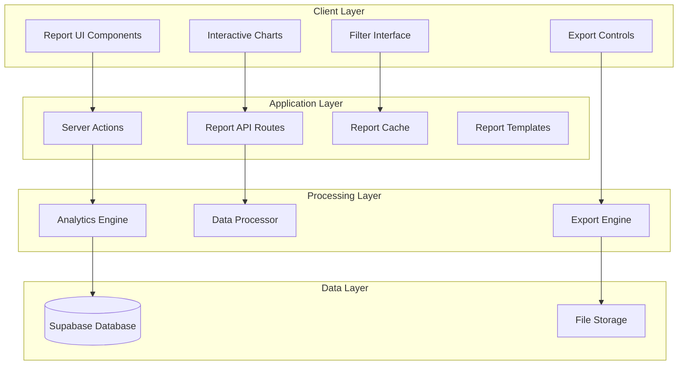

# Enhanced Reporting Dashboard Design

## Overview

This design enhances the existing reporting system by integrating modern data visualization libraries, comprehensive export capabilities, and advanced analytics features. The solution builds upon the current Next.js Server Actions architecture while adding client-side interactivity and improved user experience.

The design maintains backward compatibility with existing reports while introducing new interactive components that can be gradually adopted across all report types.

## Architecture

### High-Level Architecture



### Technology Stack

**Frontend Libraries:**
- **Recharts** (v3.6.0) - React charting library built on D3, chosen for native React integration and interactive capabilities
- **React Query** (v5.x) - Data fetching and caching, selected for its excellent caching strategy that supports Requirement 5.2-5.3
- **Zustand** (v4.x) - State management for filters and preferences, lightweight solution for Requirement 3.3
- **React Hook Form** (v7.x) - Form handling for filter interfaces, provides excellent validation for Requirement 3.5

**Export Libraries:**
- **jsPDF** (v2.x) - PDF generation with chart support, handles Requirement 2.2 for formatted PDF exports
- **xlsx** (v0.18.x) - Excel file generation, supports multi-worksheet exports for Requirement 2.3
- **html2canvas** (v1.x) - Chart to image conversion for PDFs, ensures visual fidelity in exports
- **papaparse** (v5.x) - CSV generation and parsing, handles Requirement 2.1 for CSV exports

**Performance Libraries:**
- **React Virtualized** (v9.x) - Virtual scrolling for large datasets, addresses Requirement 5.1 for >1000 records
- **React Window** (v1.x) - Efficient list rendering, alternative to React Virtualized for simpler use cases

**Analytics and Quality Libraries:**
- **simple-statistics** (v7.x) - Statistical calculations for trend analysis and confidence intervals (Requirements 6.1, 8.4)
- **ml-regression** (v6.x) - Predictive analytics for forecasting (Requirement 6.4)
- **date-fns** (v2.x) - Date manipulation for time-series analysis and period comparisons (Requirement 6.2)

## Components and Interfaces

### Core Components

#### 1. Enhanced Chart Components

```typescript
// Base chart component with common functionality
interface BaseChartProps {
  data: any[];
  loading?: boolean;
  error?: string;
  height?: number;
  responsive?: boolean;
  onDataPointClick?: (data: any) => void;
  exportable?: boolean;
}

// Specific chart implementations
interface BarChartProps extends BaseChartProps {
  xKey: string;
  yKey: string;
  colorScheme?: string[];
  stacked?: boolean;
}

interface LineChartProps extends BaseChartProps {
  xKey: string;
  yKey: string;
  multiLine?: boolean;
  showTrend?: boolean;
}

interface PieChartProps extends BaseChartProps {
  nameKey: string;
  valueKey: string;
  showPercentage?: boolean;
  innerRadius?: number;
}
```

#### 2. Filter Interface Components

```typescript
interface FilterState {
  dateRange: {
    start: Date;
    end: Date;
  };
  zones: number[];
  localities: string[];
  categories: string[];
  customFilters: Record<string, any>;
}

interface FilterInterfaceProps {
  availableFilters: FilterConfig[];
  currentFilters: FilterState;
  onFiltersChange: (filters: FilterState) => void;
  onReset: () => void;
  presets?: FilterPreset[];
}
```

#### 3. Export Engine Interface

```typescript
interface ExportOptions {
  format: 'csv' | 'pdf' | 'excel';
  includeCharts: boolean;
  includeRawData: boolean;
  pageOrientation?: 'portrait' | 'landscape';
  customFileName?: string;
}

interface ExportEngineInterface {
  exportReport(
    reportData: ReportData,
    options: ExportOptions
  ): Promise<ExportResult>;
  
  generatePDF(
    content: PDFContent,
    options: PDFOptions
  ): Promise<Blob>;
  
  generateExcel(
    worksheets: ExcelWorksheet[],
    options: ExcelOptions
  ): Promise<Blob>;
  
  generateCSV(
    data: any[],
    options: CSVOptions
  ): Promise<string>;
}
```

### API Interfaces

#### 1. Enhanced Report API

```typescript
// New API routes for enhanced functionality
interface ReportAPIRoutes {
  '/api/reports/data': {
    GET: (params: ReportParams) => Promise<ReportData>;
    POST: (config: ReportConfig) => Promise<ReportData>;
  };
  
  '/api/reports/export': {
    POST: (request: ExportRequest) => Promise<ExportResponse>;
  };
  
  '/api/reports/templates': {
    GET: () => Promise<ReportTemplate[]>;
    POST: (template: ReportTemplate) => Promise<ReportTemplate>;
    PUT: (id: string, template: ReportTemplate) => Promise<ReportTemplate>;
    DELETE: (id: string) => Promise<void>;
  };
  
  '/api/reports/cache': {
    GET: (key: string) => Promise<CachedData | null>;
    POST: (key: string, data: any, ttl: number) => Promise<void>;
    DELETE: (key: string) => Promise<void>;
  };
}
```

#### 2. Analytics Engine Interface

```typescript
interface AnalyticsEngineInterface {
  calculateTrends(
    data: TimeSeriesData[],
    period: 'daily' | 'weekly' | 'monthly'
  ): TrendAnalysis;
  
  detectAnomalies(
    data: number[],
    threshold: number
  ): AnomalyDetection[];
  
  generateInsights(
    reportData: ReportData,
    context: AnalyticsContext
  ): Insight[];
  
  predictValues(
    historicalData: TimeSeriesData[],
    periods: number
  ): PredictionResult;
  
  // Requirement 8: Data Quality and Validation
  calculateDataQuality(
    dataset: any[],
    schema: DataSchema
  ): DataQualityMetrics;
  
  validateDataIntegrity(
    data: any[],
    rules: ValidationRule[]
  ): ValidationResult[];
  
  calculateConfidenceIntervals(
    aggregatedData: AggregatedData,
    confidenceLevel: number
  ): ConfidenceInterval[];
  
  trackDataLineage(
    dataSource: string,
    transformations: DataTransformation[]
  ): DataLineage;
}

// Additional interfaces for data quality (Requirement 8)
interface DataQualityMetrics {
  completeness: number; // 0-100% (Requirement 8.1)
  accuracy: number; // 0-100%
  timeliness: Date; // Last update timestamp (Requirement 8.3)
  consistency: number; // 0-100%
  warnings: QualityWarning[]; // Warning indicators (Requirement 8.2)
  sourceAttribution: DataSource[]; // Source attribution (Requirement 8.5)
}

interface ConfidenceInterval {
  metric: string;
  lowerBound: number;
  upperBound: number;
  confidenceLevel: number; // e.g., 95%
}

interface DataLineage {
  originalSource: string;
  transformationChain: DataTransformation[];
  lastUpdated: Date;
  dataFreshness: 'fresh' | 'stale' | 'outdated';
}
```

## Data Models

### Enhanced Report Data Models

```typescript
interface EnhancedReportData {
  id: string;
  type: ReportType;
  title: string;
  description: string;
  generatedAt: Date;
  dataSource: DataSource;
  filters: FilterState;
  
  // Core data
  rawData: any[];
  aggregatedData: AggregatedData;
  
  // Visualization data
  chartConfigs: ChartConfig[];
  visualizations: VisualizationData[];
  
  // Analytics
  trends: TrendData[];
  insights: Insight[];
  qualityMetrics: DataQualityMetrics;
  
  // Export metadata
  exportable: boolean;
  supportedFormats: ExportFormat[];
}

interface ChartConfig {
  id: string;
  type: 'bar' | 'line' | 'pie' | 'area' | 'scatter';
  title: string;
  dataKey: string;
  xAxis?: AxisConfig;
  yAxis?: AxisConfig;
  colorScheme: string[];
  interactive: boolean;
  drillDownEnabled: boolean;
}

interface DataQualityMetrics {
  completeness: number; // 0-100%
  accuracy: number; // 0-100%
  timeliness: Date;
  consistency: number; // 0-100%
  warnings: QualityWarning[];
}
```

### Report Template Models

```typescript
interface ReportTemplate {
  id: string;
  name: string;
  description: string;
  category: 'standard' | 'custom' | 'system';
  createdBy: string;
  createdAt: Date;
  
  // Template configuration
  reportType: ReportType;
  defaultFilters: FilterState;
  chartConfigurations: ChartConfig[];
  layoutSettings: LayoutSettings;
  
  // Access control
  isPublic: boolean;
  allowedRoles: string[];
  
  // Usage tracking
  usageCount: number;
  lastUsed: Date;
}

interface LayoutSettings {
  columns: number;
  chartSizes: Record<string, ChartSize>;
  sectionOrder: string[];
  showDataTable: boolean;
  showInsights: boolean;
}

interface PredefinedTemplates {
  // Requirement 4.1: At least 5 predefined templates
  demographicOverview: ReportTemplate;
  aidDistributionSummary: ReportTemplate;
  voterAnalysisDashboard: ReportTemplate;
  issueResolutionTracking: ReportTemplate;
  zonePerformanceMetrics: ReportTemplate;
}
```

### Design Rationale for Key Components

**Chart Library Selection (Recharts)**:
- **Rationale**: Recharts was chosen over alternatives like Chart.js or D3 because it provides native React integration, built-in responsiveness, and excellent TypeScript support. It handles the interactive requirements (hover tooltips, zoom, drill-down) out of the box while maintaining good performance with large datasets.

**State Management Strategy (Zustand + React Query)**:
- **Rationale**: Zustand provides lightweight state management for filter preferences and UI state, while React Query handles server state, caching, and background updates. This combination addresses Requirements 3.3 (filter persistence) and 5.2-5.3 (caching) efficiently.

**Export Engine Architecture**:
- **Rationale**: The modular export engine design allows for format-specific optimizations while maintaining a consistent interface. Using html2canvas for chart-to-image conversion ensures visual fidelity in PDF exports, addressing Requirement 2.2.

**Template System Design**:
- **Rationale**: The template system separates configuration from presentation, allowing for the 5+ predefined templates (Requirement 4.1) while supporting custom template creation (Requirement 4.3). The metadata tracking satisfies Requirement 4.4.

**Performance Optimization Strategy**:
- **Rationale**: The multi-layered approach (React Virtualized for UI, Redis for server caching, Web Workers for processing) addresses different aspects of performance. The 1000-record threshold (Requirement 5.1) triggers pagination to maintain responsiveness.

**Mobile-First Responsive Design**:
- **Rationale**: Starting with mobile constraints ensures all components work across device sizes. Touch-friendly controls and adaptive layouts address Requirements 7.1-7.5 comprehensively.
```

## Correctness Properties

*A property is a characteristic or behavior that should hold true across all valid executions of a system-essentially, a formal statement about what the system should do. Properties serve as the bridge between human-readable specifications and machine-verifiable correctness guarantees.*

<function_calls>
<invoke name="prework">
<parameter name="featureName">enhanced-reporting-dashboard

### Property Reflection

After analyzing all acceptance criteria, I identified several areas where properties can be consolidated:

**Consolidation Opportunities:**
- Properties 1.1-1.5 (Interactive Visualization) can be combined into comprehensive chart functionality properties
- Properties 2.1-2.5 (Export Capabilities) can be streamlined into format-specific export properties
- Properties 3.1-3.5 (Filtering) can be consolidated into filter behavior and persistence properties
- Properties 7.1-7.5 (Mobile Responsiveness) can be combined into responsive design properties

**Final Property Set:**
After reflection, the following properties provide unique validation value without redundancy:

### Correctness Properties

Property 1: Interactive Chart Generation
*For any* report containing numerical data, the system should generate interactive charts with hover tooltips, zoom capabilities, and drill-down functionality for all supported chart types (bar, line, pie, area, scatter)
**Validates: Requirements 1.1, 1.2, 1.3**

Property 2: Time-Series Controls
*For any* time-series data display, the system should provide functional date range selection controls that update the visualization in real-time
**Validates: Requirements 1.4**

Property 3: Visual Consistency
*For any* set of visualization components across different report types, styling properties (colors, fonts, spacing) should remain consistent
**Validates: Requirements 1.5**

Property 4: Multi-Format Export
*For any* report export request, the system should generate valid files in the requested format (CSV, PDF, Excel) with appropriate content preservation
**Validates: Requirements 2.1, 2.4**

Property 5: PDF Export Completeness
*For any* PDF export, the generated file should contain all charts, tables, and formatted layouts with proper pagination
**Validates: Requirements 2.2**

Property 6: Excel Worksheet Structure
*For any* Excel export, the generated file should contain multiple worksheets corresponding to different data sections
**Validates: Requirements 2.3**

Property 7: Export Completion Interface
*For any* completed export operation, the system should provide download links with accurate file size information
**Validates: Requirements 2.5**

Property 8: Filter Availability
*For any* report type, the filter interface should provide all specified filter types (date range, zone, locality, category)
**Validates: Requirements 3.1**

Property 9: Real-Time Filter Updates
*For any* filter application, charts and tables should update without page refresh while maintaining data integrity
**Validates: Requirements 3.2**

Property 10: Filter Persistence
*For any* user session, filter preferences should be saved and restored on subsequent visits to the same report
**Validates: Requirements 3.3**

Property 11: Filter Indicator Display
*For any* active filter combination, the system should display clear indicators with functional removal options
**Validates: Requirements 3.4**

Property 12: Filter Validation
*For any* attempted filter combination, the system should prevent invalid selections and provide appropriate feedback
**Validates: Requirements 3.5**

Property 13: Template Application
*For any* selected report template, the system should automatically apply the correct filters and visualization settings
**Validates: Requirements 4.2**

Property 14: Custom Template Creation
*For any* custom report configuration, users should be able to save it as a personal template with all settings preserved
**Validates: Requirements 4.3**

Property 15: Template Metadata Inclusion
*For any* report generated from a template, the output should include template metadata and generation timestamps
**Validates: Requirements 4.4**

Property 16: Template Customization
*For any* template parameter modification, the base template structure should remain intact while allowing customization
**Validates: Requirements 4.5**

Property 17: Large Dataset Handling
*For any* report with more than 1000 records, the system should implement pagination or data streaming without performance degradation
**Validates: Requirements 5.1**

Property 18: Cache Performance
*For any* cached report data, the system should display reports within 2 seconds when cache is available and valid
**Validates: Requirements 5.2, 5.3**

Property 19: Background Processing
*For any* large dataset processing, the user interface should remain responsive while processing occurs in the background
**Validates: Requirements 5.4**

Property 20: Progress Indication
*For any* data processing operation, the system should display progress indicators with estimated completion times
**Validates: Requirements 5.5**

Property 21: Trend Calculation
*For any* time-series data, the analytics engine should calculate and display trend indicators with percentage changes over specified periods
**Validates: Requirements 6.1**

Property 22: Period Comparison
*For any* metric display, the system should include comparison data from previous periods where applicable
**Validates: Requirements 6.2**

Property 23: Anomaly Detection
*For any* dataset with statistical anomalies, the system should identify and highlight significant changes or outliers
**Validates: Requirements 6.3**

Property 24: Predictive Insights
*For any* historical data pattern, the system should generate predictive insights based on trend analysis
**Validates: Requirements 6.4**

Property 25: Contextual Explanations
*For any* dashboard metric, the system should provide contextual explanations for calculated values
**Validates: Requirements 6.5**

Property 26: Mobile Chart Adaptation
*For any* chart displayed on mobile devices, the layout should adapt appropriately for small screen viewing
**Validates: Requirements 7.1**

Property 27: Mobile Filter Controls
*For any* filter interface on mobile devices, controls should be touch-friendly and optimized for mobile interaction
**Validates: Requirements 7.2**

Property 28: Mobile Table Display
*For any* table viewed on mobile devices, horizontal scrolling should work with sticky column headers
**Validates: Requirements 7.3**

Property 29: Responsive Visualization
*For any* visualization component, readability and functionality should be maintained across all device sizes
**Validates: Requirements 7.4**

Property 30: Mobile Export Optimization
*For any* export operation from mobile devices, generated files should be appropriately sized for mobile sharing
**Validates: Requirements 7.5**

Property 31: Data Quality Metrics
*For any* report section, the system should calculate and display data completeness percentages accurately
**Validates: Requirements 8.1**

Property 32: Quality Warning Display
*For any* detected data quality issue, the system should show warning indicators with explanatory tooltips
**Validates: Requirements 8.2**

Property 33: Timestamp Tracking
*For any* data source, the system should track and display the last update timestamp
**Validates: Requirements 8.3**

Property 34: Confidence Intervals
*For any* aggregated data display, the system should include confidence intervals where statistically applicable
**Validates: Requirements 8.4**

Property 35: Data Source Attribution
*For any* metric or calculation, the system should provide clear data source attribution
**Validates: Requirements 8.5**

## Error Handling

### Client-Side Error Handling

**Chart Rendering Errors:**
- Graceful fallback to table view when chart rendering fails
- Error boundaries around chart components to prevent app crashes
- Retry mechanisms for transient rendering issues
- User-friendly error messages with actionable suggestions

**Export Errors:**
- Timeout handling for large export operations
- File size validation before export generation
- Format-specific error handling (PDF generation, Excel creation)
- Progress cancellation capabilities

**Filter Errors:**
- Validation of filter combinations before application
- Graceful handling of invalid date ranges
- Recovery from corrupted filter state in localStorage
- Clear error messages for filter conflicts

### Server-Side Error Handling

**Data Processing Errors:**
- Graceful degradation when data sources are unavailable
- Timeout handling for long-running analytics operations
- Memory management for large dataset processing
- Automatic retry with exponential backoff for transient failures

**Cache Errors:**
- Fallback to direct database queries when cache is unavailable
- Cache invalidation on data inconsistencies
- Graceful handling of cache corruption
- Performance monitoring and alerting

**Template Errors:**
- Validation of template configurations before saving
- Graceful handling of missing template dependencies
- Version compatibility checks for template upgrades
- Rollback capabilities for failed template applications

## Testing Strategy

**Dual Testing Approach**:
- **Unit tests**: Verify specific examples, edge cases, and error conditions
- **Property tests**: Verify universal properties across all inputs
- Both are complementary and necessary for comprehensive coverage

**Unit Testing Balance**:
- Unit tests are helpful for specific examples and edge cases
- Avoid writing too many unit tests - property-based tests handle covering lots of inputs
- Unit tests should focus on:
  - Specific examples that demonstrate correct behavior
  - Integration points between components
  - Edge cases and error conditions
- Property tests should focus on:
  - Universal properties that hold for all inputs
  - Comprehensive input coverage through randomization

**Property Test Configuration**:
- Minimum 100 iterations per property test (due to randomization)
- Each property test must reference its design document property
- Tag format: **Feature: enhanced-reporting-dashboard, Property {number}: {property_text}**

**Testing Framework Selection**:
- **Jest** with **@testing-library/react** for unit tests
- **fast-check** for property-based testing in TypeScript/JavaScript
- **Playwright** for end-to-end testing of export functionality
- **React Testing Library** for component interaction testing

**Performance Testing**:
- Load testing with datasets of varying sizes (100, 1K, 10K, 100K records)
- Memory usage monitoring during large dataset processing
- Export generation time benchmarking across different formats
- Cache hit/miss ratio monitoring and optimization

**Mobile Testing Strategy**:
- Responsive design testing across multiple device sizes
- Touch interaction testing for mobile filter controls
- Export functionality testing on mobile browsers
- Performance testing on lower-powered mobile devices
